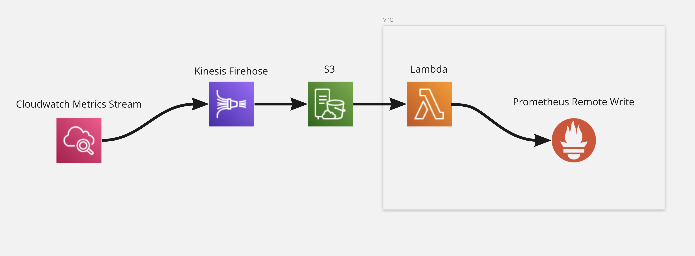

# terraform-aws-cloudwatch-prometheus

Are you fed up with the costs, faf and effort of maintaining cloudwatch exporters to get metrics into your prometheus setup?
Maybe you are using one of the following:

- [Official Cloudwatch Prometheus Exporter](https://github.com/prometheus/cloudwatch_exporter)
- [YACE - Yet Another Prometheus Exporter](https://github.com/nerdswords/yet-another-cloudwatch-exporter)

These are expensive and costly in terms of number of API calls no matter how you look at it.

Thankfully AWS released [Cloudwatch Metric Steams](https://aws.amazon.com/blogs/aws/cloudwatch-metric-streams-send-aws-metrics-to-partners-and-to-your-apps-in-real-time/) to connect to metrics partners like [Datadog](https://www.datadoghq.com/) or [New Relic](https://newrelic.com/).

This is a terraform module that does the same thing but connects to one of your prometheus remote write endpoints directly.

## Features

- Blazingly fast, efficient metrics that you want directly in prometheus.
- Standardized prometheus  `__naming__` in `snake_case`
- Currently supporting `lambda` and `sqs` (More coming soon)

## System Architecture

<!-- BEGIN_TF_DOCS -->
## Providers

| Name | Version |
|------|---------|
|  [aws](#provider\_aws) | >= 3.75.1 |

## Resources

| Name | Type |
|------|------|
| [aws_cloudwatch_log_group.logs](https://registry.terraform.io/providers/hashicorp/aws/latest/docs/resources/cloudwatch_log_group) | resource |
| [aws_cloudwatch_metric_stream.main](https://registry.terraform.io/providers/hashicorp/aws/latest/docs/resources/cloudwatch_metric_stream) | resource |
| [aws_iam_policy.assume_cross_account_policy](https://registry.terraform.io/providers/hashicorp/aws/latest/docs/resources/iam_policy) | resource |
| [aws_iam_role.cloudwatch_metrics_firehose_role](https://registry.terraform.io/providers/hashicorp/aws/latest/docs/resources/iam_role) | resource |
| [aws_iam_role.iam_for_lambda](https://registry.terraform.io/providers/hashicorp/aws/latest/docs/resources/iam_role) | resource |
| [aws_iam_role.metric_stream_to_firehose](https://registry.terraform.io/providers/hashicorp/aws/latest/docs/resources/iam_role) | resource |
| [aws_iam_role_policy.cloudwatch_metrics_firehose_lambda_policy](https://registry.terraform.io/providers/hashicorp/aws/latest/docs/resources/iam_role_policy) | resource |
| [aws_iam_role_policy.cloudwatch_metrics_s3_policy](https://registry.terraform.io/providers/hashicorp/aws/latest/docs/resources/iam_role_policy) | resource |
| [aws_iam_role_policy.metric_stream_to_firehose](https://registry.terraform.io/providers/hashicorp/aws/latest/docs/resources/iam_role_policy) | resource |
| [aws_iam_role_policy_attachment.aps](https://registry.terraform.io/providers/hashicorp/aws/latest/docs/resources/iam_role_policy_attachment) | resource |
| [aws_iam_role_policy_attachment.assume_cross_account_role](https://registry.terraform.io/providers/hashicorp/aws/latest/docs/resources/iam_role_policy_attachment) | resource |
| [aws_iam_role_policy_attachment.execution](https://registry.terraform.io/providers/hashicorp/aws/latest/docs/resources/iam_role_policy_attachment) | resource |
| [aws_iam_role_policy_attachment.vpc](https://registry.terraform.io/providers/hashicorp/aws/latest/docs/resources/iam_role_policy_attachment) | resource |
| [aws_kinesis_firehose_delivery_stream.cloudwatch_metrics_firehose_delivery_stream](https://registry.terraform.io/providers/hashicorp/aws/latest/docs/resources/kinesis_firehose_delivery_stream) | resource |
| [aws_lambda_function.cloudwatch_metrics_firehose_prometheus_remote_write](https://registry.terraform.io/providers/hashicorp/aws/latest/docs/resources/lambda_function) | resource |
| [aws_s3_bucket.cloudwatch_metrics_firehose_bucket](https://registry.terraform.io/providers/hashicorp/aws/latest/docs/resources/s3_bucket) | resource |
| [aws_s3_bucket_lifecycle_configuration.cloudwatch_metrics_firehose_remove_after_10_days](https://registry.terraform.io/providers/hashicorp/aws/latest/docs/resources/s3_bucket_lifecycle_configuration) | resource |
| [aws_security_group.this](https://registry.terraform.io/providers/hashicorp/aws/latest/docs/resources/security_group) | resource |
| [aws_security_group_rule.this](https://registry.terraform.io/providers/hashicorp/aws/latest/docs/resources/security_group_rule) | resource |

## Inputs

| Name | Description | Type | Default | Required |
|------|-------------|------|---------|:--------:|
|  [deploy\_in\_vpc](#input\_deploy\_in\_vpc) | Whether to deploy the lambda in a VPC | `bool` | `false` | no |
|  [prometheus\_settings](#input\_prometheus\_settings) | The prometheus settings to use for the lambda.   lambda\_name: The name of the lambda to create.   writer\_endpoint: The prometheus remote write endpoint to write metrics   role\_arn: (optional) The role arn to assume to write to the prometheus remote write endpoints. If not provided, the lambda will use credentials from its execution role. | <pre>object({     lambda_name = string     writer_endpoint = string     role_arn = optional(string)   })</pre> | n/a | yes |
|  [region](#input\_region) | The region to create the lambda in | `string` | n/a | yes |
|  [stream\_settings](#input\_stream\_settings) | The settings for the stream to create.   firehose\_stream\_name: The name of the firehose stream to create.   metric\_stream\_name: The name of the cloudwatch metric stream to create.   s3\_bucket\_name: The name of the s3 bucket to create.   metric\_filters: The list of metric filters to include in the stream.   include\_linked\_accounts\_metrics: Whether to include linked account metrics in the stream.   buffer\_size\_in\_mb: (optional) The buffer size in mb for the lambda. Default is 1.   buffer\_interval\_in\_seconds: (optional) The buffer interval in seconds for the lambda. Default is 300. | <pre>object({     firehose_stream_name = string     metric_stream_name = string     s3_bucket_name = string     metric_filters = list(object({       namespace = string       metric_names = list(string)     }))     include_linked_accounts_metrics = bool     buffer_size_in_mb = optional(string, "1")     buffer_interval_in_seconds = optional(string, "300")   })</pre> | n/a | yes |
|  [tags](#input\_tags) | The standard tags to apply to every AWS resource. | `map(string)` | `{}` | no |
|  [vpc\_config](#input\_vpc\_config) | The VPC config to create the lambda in.   If deploy\_in\_vpc is false, this will be ignored.   If deploy\_in\_vpc is true, this will be used to create the lambda in the VPC.    vpc\_id: The VPC to create the lambda in.   subnet\_ids: The subnet ids to create the lambda in.   security\_group\_ids: (optional) The security group ids to use for the lambda. If not provided, a new security group will be created. | <pre>object({     vpc_id = string     subnet_ids = list(string)     security_group_ids = optional(list(string),[])   })</pre> | `null` | no |
<!-- END_TF_DOCS -->

## Thank you
[AWS Recipe](https://aws-observability.github.io/aws-o11y-recipes/recipes/lambda-cw-metrics-go-amp/) - This draws heavily on this (using a modified version of the go code in their [lambda](https://github.com/aws-observability/aws-o11y-recipes/tree/main/sandbox/CWMetricStreamExporter/lambda))
